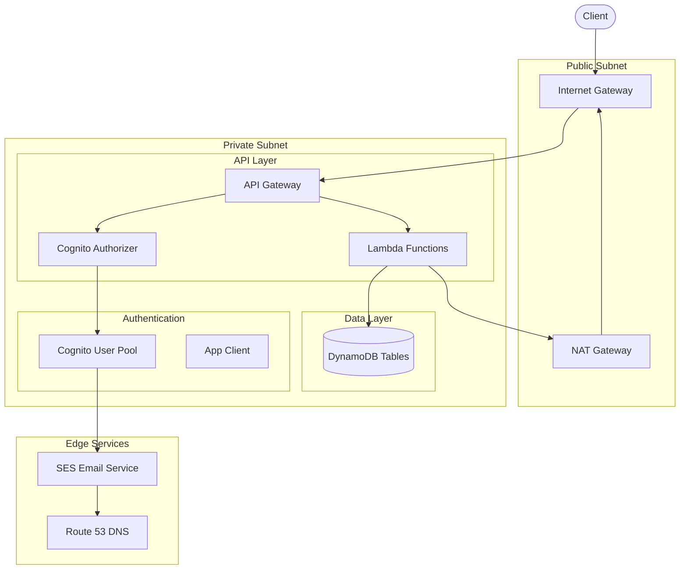
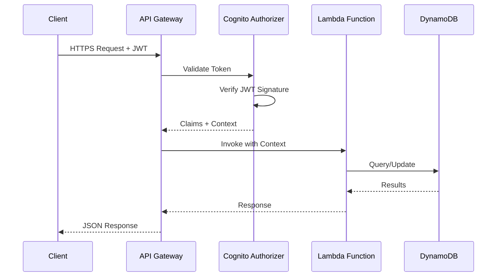
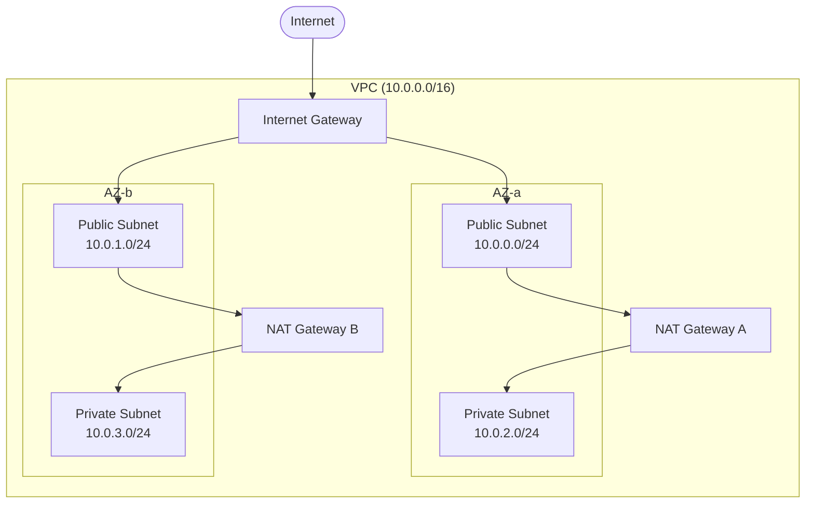
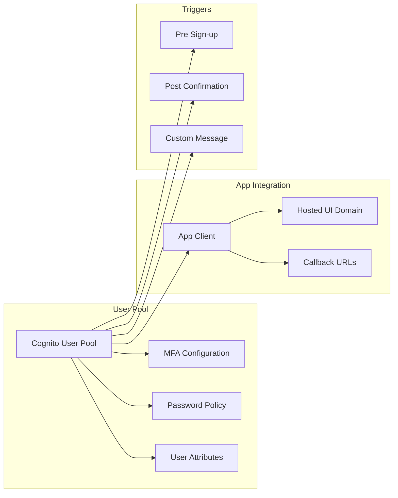
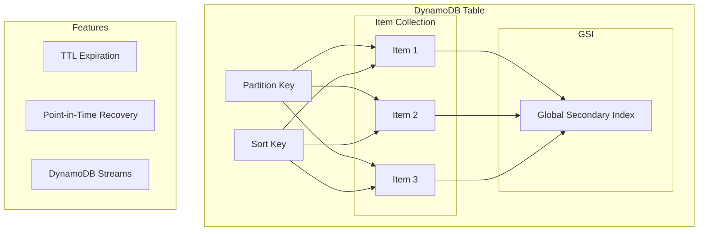
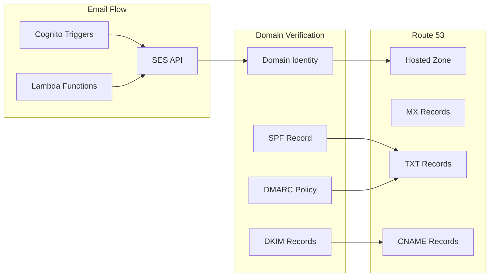
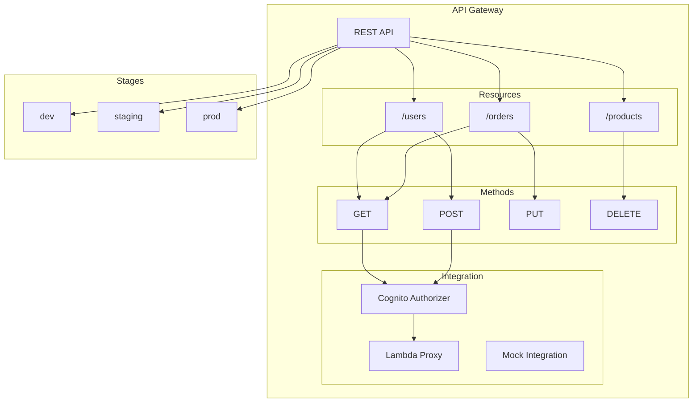
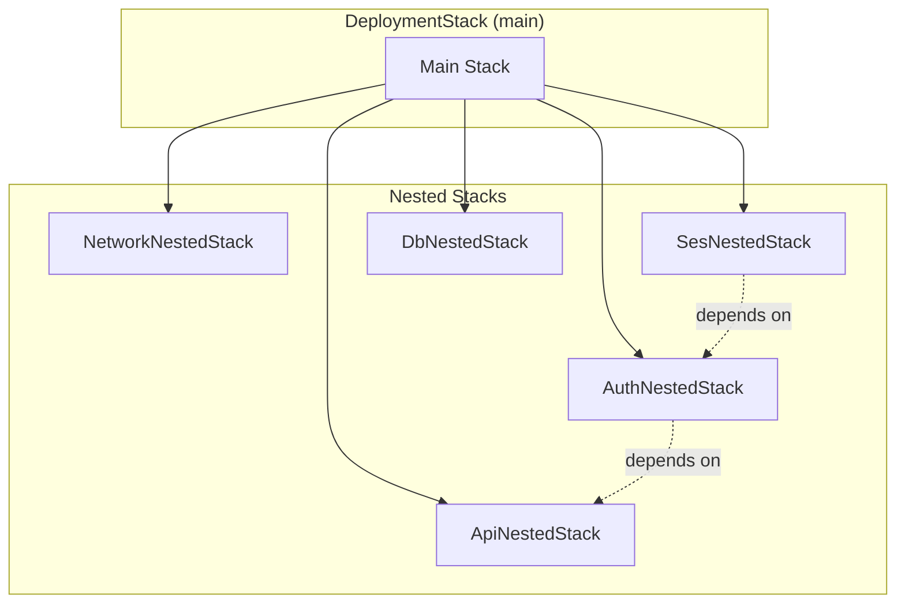

# aws-webapp-infra

<div align="center">

*AWS CDK application written in Java that provisions a complete serverless web application infrastructure with authentication, database, email services, and API Gateway for building modern web applications.*

[](https://opensource.org/licenses/MIT)
[](https://www.oracle.com/java/)
[](https://aws.amazon.com/cdk/)
[](https://aws.amazon.com/vpc/)
[](https://aws.amazon.com/cognito/)
[](https://aws.amazon.com/ses/)
[](https://aws.amazon.com/dynamodb/)
[](https://aws.amazon.com/api-gateway/)
[](https://aws.amazon.com/lambda/)

</div>

---

## Overview

This CDK application provisions a complete serverless web application infrastructure with five main components, designed to integrate seamlessly with the Fastish platform services. The architecture follows [AWS Serverless Application Lens](https://docs.aws.amazon.com/wellarchitected/latest/serverless-applications-lens/welcome.html) best practices.

### System Architecture



### Request Flow



---

## Infrastructure Components

### 1. Network (VPC)

The network layer establishes isolated cloud infrastructure following [AWS VPC best practices](https://docs.aws.amazon.com/vpc/latest/userguide/vpc-security-best-practices.html):



| Component | Purpose | Reference |
|-----------|---------|-----------|
| **Public Subnets** | Host NAT gateways and internet-facing resources | [VPC Subnets](https://docs.aws.amazon.com/vpc/latest/userguide/configure-subnets.html) |
| **Private Subnets** | Isolate backend resources (Cognito, Lambda functions) | [Private Subnets](https://docs.aws.amazon.com/vpc/latest/userguide/VPC_Scenario2.html) |
| **Internet Gateway** | Enable outbound internet access | [Internet Gateways](https://docs.aws.amazon.com/vpc/latest/userguide/VPC_Internet_Gateway.html) |
| **NAT Gateways** | Allow private subnet resources to access the internet | [NAT Gateways](https://docs.aws.amazon.com/vpc/latest/userguide/vpc-nat-gateway.html) |
| **Route Tables** | Manage traffic flow between subnets and internet | [Route Tables](https://docs.aws.amazon.com/vpc/latest/userguide/VPC_Route_Tables.html) |

### 2. Authentication (Cognito)

User authentication and identity management powered by [Amazon Cognito](https://docs.aws.amazon.com/cognito/latest/developerguide/what-is-amazon-cognito.html):



| Feature | Configuration | Reference |
|---------|---------------|-----------|
| **User Pool** | Manages user registration, authentication, and profile data | [User Pools](https://docs.aws.amazon.com/cognito/latest/developerguide/cognito-user-identity-pools.html) |
| **Password Policy** | Enforces minimum length of 8 characters | [Password Policies](https://docs.aws.amazon.com/cognito/latest/developerguide/user-pool-settings-policies.html) |
| **MFA Configuration** | Supports optional multi-factor authentication | [MFA](https://docs.aws.amazon.com/cognito/latest/developerguide/user-pool-settings-mfa.html) |
| **Standard Attributes** | Email (required and mutable) | [User Attributes](https://docs.aws.amazon.com/cognito/latest/developerguide/user-pool-settings-attributes.html) |
| **Email Verification** | Automated via SES integration | [Email Verification](https://docs.aws.amazon.com/cognito/latest/developerguide/cognito-user-pool-settings-email-verification-message-customization.html) |
| **Account Recovery** | Email-based password reset flow | [Account Recovery](https://docs.aws.amazon.com/cognito/latest/developerguide/how-to-recover-a-user-account.html) |
| **VPC Integration** | Deployed in private subnets for enhanced security | [Lambda Triggers](https://docs.aws.amazon.com/cognito/latest/developerguide/cognito-user-identity-pools-working-with-aws-lambda-triggers.html) |

### 3. Database (DynamoDB)

NoSQL data storage using [Amazon DynamoDB](https://docs.aws.amazon.com/amazondynamodb/latest/developerguide/Introduction.html):



| Feature | Configuration | Reference |
|---------|---------------|-----------|
| **Tables** | NoSQL tables for application data storage | [Core Components](https://docs.aws.amazon.com/amazondynamodb/latest/developerguide/HowItWorks.CoreComponents.html) |
| **Partition Keys** | Optimized for access patterns | [Partition Key Design](https://docs.aws.amazon.com/amazondynamodb/latest/developerguide/bp-partition-key-design.html) |
| **Billing Mode** | Pay-per-request (on-demand) or provisioned capacity | [Read/Write Capacity](https://docs.aws.amazon.com/amazondynamodb/latest/developerguide/HowItWorks.ReadWriteCapacityMode.html) |
| **Encryption** | Server-side encryption at rest enabled by default | [Encryption at Rest](https://docs.aws.amazon.com/amazondynamodb/latest/developerguide/EncryptionAtRest.html) |
| **Point-in-Time Recovery** | Optional backup and restore capability | [PITR](https://docs.aws.amazon.com/amazondynamodb/latest/developerguide/PointInTimeRecovery.html) |
| **Global Secondary Indexes** | Additional query patterns as needed | [GSI](https://docs.aws.amazon.com/amazondynamodb/latest/developerguide/GSI.html) |

### 4. Email Service (SES)

Transactional email delivery via [Amazon SES](https://docs.aws.amazon.com/ses/latest/dg/Welcome.html):



| Feature | Configuration | Reference |
|---------|---------------|-----------|
| **Domain Identity** | Verifies your domain for sending emails | [Domain Verification](https://docs.aws.amazon.com/ses/latest/dg/creating-identities.html#verify-domain-procedure) |
| **Email Identity** | Verifies specific email addresses | [Email Verification](https://docs.aws.amazon.com/ses/latest/dg/creating-identities.html#verify-email-addresses-procedure) |
| **DKIM Signing** | Authenticates emails to prevent spoofing | [DKIM](https://docs.aws.amazon.com/ses/latest/dg/send-email-authentication-dkim.html) |
| **Route 53 Integration** | Automatically creates required DNS records | [Route 53 DNS](https://docs.aws.amazon.com/ses/latest/dg/creating-identities.html#just-verify-domain-proc) |
| **Sending Authorization** | IAM policies for secure email sending | [Authorization](https://docs.aws.amazon.com/ses/latest/dg/sending-authorization.html) |

### 5. API Gateway

RESTful API infrastructure using [Amazon API Gateway](https://docs.aws.amazon.com/apigateway/latest/developerguide/welcome.html):



| Feature | Configuration | Reference |
|---------|---------------|-----------|
| **REST API** | HTTP endpoints for client-server communication | [REST APIs](https://docs.aws.amazon.com/apigateway/latest/developerguide/apigateway-rest-api.html) |
| **Cognito Authorizer** | Validates JWT tokens from Cognito user pool | [Cognito Authorizer](https://docs.aws.amazon.com/apigateway/latest/developerguide/apigateway-integrate-with-cognito.html) |
| **Lambda Integration** | Routes requests to backend Lambda functions | [Lambda Integration](https://docs.aws.amazon.com/apigateway/latest/developerguide/set-up-lambda-integrations.html) |
| **CORS Configuration** | Enables cross-origin requests from web clients | [CORS](https://docs.aws.amazon.com/apigateway/latest/developerguide/how-to-cors.html) |
| **Deployment Stages** | Separate environments (dev, staging, prod) | [Stages](https://docs.aws.amazon.com/apigateway/latest/developerguide/stages.html) |
| **Request Validation** | Schema-based validation of API requests | [Request Validation](https://docs.aws.amazon.com/apigateway/latest/developerguide/api-gateway-method-request-validation.html) |
| **Usage Plans** | Optional rate limiting and throttling | [Usage Plans](https://docs.aws.amazon.com/apigateway/latest/developerguide/api-gateway-api-usage-plans.html) |

---

## Stack Architecture

The webapp infrastructure uses a layered architecture with [CloudFormation nested stacks](https://docs.aws.amazon.com/AWSCloudFormation/latest/UserGuide/using-cfn-nested-stacks.html):



**Dependency Chain**:

1. Network and SES are created first (independent)
2. Auth waits for SES (email verification dependency)
3. API waits for Auth (Cognito authorizer dependency)
4. DB is created independently

### Platform Integration

When deployed through the Fastish platform, this infrastructure integrates with internal platform services for automated deployment and management.

| Platform Component | Integration Point | Purpose |
|--------------------|-------------------|---------|
| **Orchestrator** | Release pipeline automation | Automated CDK synthesis and deployment via CodePipeline |
| **Portal** | Subscriber management | Tenant provisioning and access control |
| **Network** | Shared VPC peering | Cross-stack connectivity for platform services |
| **Reporting** | Usage metering | Pipeline execution tracking and cost attribution |

These integrations are managed automatically when deploying via the platform's release workflows.

---

## Prerequisites

| Requirement | Version | Installation | Verification |
|-------------|---------|--------------|--------------|
| **Java** | 21+ | [SDKMAN](https://sdkman.io/) | `java --version` |
| **Maven** | 3.8+ | [Maven Download](https://maven.apache.org/download.cgi) | `mvn --version` |
| **AWS CLI** | 2.x | [AWS CLI Install](https://docs.aws.amazon.com/cli/latest/userguide/getting-started-install.html) | `aws --version` |
| **AWS CDK CLI** | 2.221.0+ | [CDK Getting Started](https://docs.aws.amazon.com/cdk/v2/guide/getting-started.html) | `cdk --version` |
| **GitHub CLI** | Latest | [GitHub CLI](https://cli.github.com/) | `gh --version` |

**Additional Requirements**:
- Registered domain in [Route 53](https://docs.aws.amazon.com/Route53/latest/DeveloperGuide/Welcome.html) for SES integration
- AWS account [bootstrapped for CDK](https://docs.aws.amazon.com/cdk/v2/guide/bootstrapping.html):

```bash
cdk bootstrap aws://<account-id>/<region>
```

> Replace `<account-id>` with your AWS account ID and `<region>` with your desired AWS region (e.g., `us-west-2`).
> This sets up necessary resources for CDK deployments including an S3 bucket for assets and CloudFormation execution roles.
> See: [CDK Bootstrapping](https://docs.aws.amazon.com/cdk/v2/guide/bootstrapping.html) | [Bootstrap CLI Reference](https://docs.aws.amazon.com/cdk/v2/guide/ref-cli-cmd-bootstrap.html)

---

## Deployment

### Step 1: Clone Repositories

```bash
gh repo clone fast-ish/cdk-common
gh repo clone fast-ish/aws-webapp-infra
```

### Step 2: Build Projects

```bash
mvn -f cdk-common/pom.xml clean install
mvn -f aws-webapp-infra/pom.xml clean install
```

### Step 3: Setup Local Maven Repository Symlink

The infrastructure configuration references Lambda function artifacts from the Maven local repository at `/root/.m2/repository`. This path works in AWS CodePipeline (which runs as root), but locally your Maven repository is at `~/.m2/repository`.

To ensure the same configuration works in both environments:

```bash
sudo ln -s ~/.m2 /root/.m2
```

| Environment | Maven Repository Path | Notes |
|-------------|----------------------|-------|
| Local Development | `~/.m2/repository` | User home directory |
| AWS CodePipeline | `/root/.m2/repository` | Runs as root user |

### Step 4: Configure Deployment

Create `aws-webapp-infra/infra/cdk.context.json` from `aws-webapp-infra/infra/cdk.context.template.json`:

**Required Configuration Parameters**:

| Parameter | Description | Example |
|-----------|-------------|---------|
| `:account` | AWS account ID (12-digit number) | `123456789012` |
| `:region` | AWS region for deployment | `us-west-2` |
| `:domain` | Registered domain in Route 53 for SES | `example.com` |
| `:ses:hosted:zone` | Route 53 hosted zone ID for DNS records | `Z1234567890ABC` |
| `:ses:email` | Email address for SES verification | `no-reply@example.com` |
| `:environment` | Environment name (do not change) | `prototype` |
| `:version` | Resource version identifier | `v1` |

**Notes**:
- `:environment` and `:version` map to resource files at `aws-webapp-infra/infra/src/main/resources/prototype/v1`
- Domain must be registered and hosted in Route 53 before deployment
- Email address will receive a verification link from SES

### Step 5: Deploy Infrastructure

```bash
cd aws-webapp-infra/infra

# Preview changes
cdk synth

# Deploy all stacks
cdk deploy
```

See: [CDK Deploy Command](https://docs.aws.amazon.com/cdk/v2/guide/ref-cli-cmd-deploy.html) | [CDK Synth Command](https://docs.aws.amazon.com/cdk/v2/guide/ref-cli-cmd-synth.html)

**What Gets Deployed**:

| Resource Type | Count | Description | Reference |
|---------------|-------|-------------|-----------|
| CloudFormation Stacks | 6 | 1 main + 5 nested stacks | [Nested Stacks](https://docs.aws.amazon.com/AWSCloudFormation/latest/UserGuide/using-cfn-nested-stacks.html) |
| VPC | 1 | 2 AZs, public/private subnets | [VPC Documentation](https://docs.aws.amazon.com/vpc/latest/userguide/what-is-amazon-vpc.html) |
| Cognito User Pool | 1 | With VPC endpoints | [Cognito User Pools](https://docs.aws.amazon.com/cognito/latest/developerguide/cognito-user-identity-pools.html) |
| DynamoDB Tables | Variable | As defined in configuration | [DynamoDB Tables](https://docs.aws.amazon.com/amazondynamodb/latest/developerguide/WorkingWithTables.html) |
| SES Identities | 2 | Domain + email with DKIM | [SES Identities](https://docs.aws.amazon.com/ses/latest/dg/creating-identities.html) |
| API Gateway | 1 | With Lambda integrations | [REST APIs](https://docs.aws.amazon.com/apigateway/latest/developerguide/apigateway-rest-api.html) |

### Step 6: Verify SES Email

After deployment completes:

1. Check the email inbox for `:ses:email`
2. Click the verification link from Amazon SES
3. Confirmation is required before Cognito can send emails

See: [SES Email Verification](https://docs.aws.amazon.com/ses/latest/dg/creating-identities.html#verify-email-addresses-procedure)

---

## Configuration Reference

### CDK Context Variables

The build process uses [Mustache templating](https://mustache.github.io/) to inject context variables into configuration files. See [cdk-common](https://github.com/fast-ish/cdk-common) for the complete build process documentation.

| Variable | Type | Description |
|----------|------|-------------|
| `{{account}}` | String | AWS account ID |
| `{{region}}` | String | AWS region |
| `{{domain}}` | String | Route 53 domain |
| `{{environment}}` | String | Environment name |
| `{{version}}` | String | Resource version |

### Template Structure

```
src/main/resources/
└── prototype/
    └── v1/
        ├── conf.mustache           # Main configuration
        ├── network/
        │   └── vpc.mustache        # VPC configuration
        ├── auth/
        │   └── cognito.mustache    # Cognito configuration
        ├── db/
        │   └── dynamodb.mustache   # DynamoDB configuration
        ├── ses/
        │   └── ses.mustache        # SES configuration
        └── api/
            └── gateway.mustache    # API Gateway configuration
```

---

## Security Considerations

| Layer | Implementation | Reference |
|-------|----------------|-----------|
| **Network** | Private subnets, security groups, NACLs | [VPC Security](https://docs.aws.amazon.com/vpc/latest/userguide/vpc-security-best-practices.html) |
| **Authentication** | Cognito JWT validation, MFA support | [Cognito Security](https://docs.aws.amazon.com/cognito/latest/developerguide/security.html) |
| **API** | Request validation, throttling, WAF integration | [API Gateway Security](https://docs.aws.amazon.com/apigateway/latest/developerguide/security.html) |
| **Data** | DynamoDB encryption at rest, IAM policies | [DynamoDB Security](https://docs.aws.amazon.com/amazondynamodb/latest/developerguide/security.html) |
| **Email** | DKIM, SPF, DMARC | [SES Authentication](https://docs.aws.amazon.com/ses/latest/dg/send-email-authentication.html) |

---

## Troubleshooting

For common deployment issues and resolutions, see the [Troubleshooting Guide](https://fast-ish.github.io/docs/TROUBLESHOOTING.html).

### Quick Diagnostics

```bash
# Check stack status
aws cloudformation describe-stacks --stack-name <stack-name> --query 'Stacks[0].StackStatus'

# View recent stack events
aws cloudformation describe-stack-events --stack-name <stack-name> --query 'StackEvents[0:5]'

# Test API Gateway endpoint
curl -I $(aws cloudformation describe-stacks --stack-name <stack-name> \
  --query 'Stacks[0].Outputs[?OutputKey==`ApiEndpoint`].OutputValue' --output text)

# Check Cognito User Pool status
aws cognito-idp describe-user-pool --user-pool-id <pool-id> --query 'UserPool.Status'
```

---

## Related Documentation

### Platform Documentation

| Resource | Description |
|----------|-------------|
| [Fastish Documentation](https://fast-ish.github.io) | Main documentation hub |
| [Troubleshooting](https://fast-ish.github.io/docs/TROUBLESHOOTING.html) | Common issues and resolutions |
| [Deployment Validation](https://fast-ish.github.io/docs/VALIDATION.html) | Post-deployment health checks |
| [Upgrade Guide](https://fast-ish.github.io/docs/UPGRADE.html) | Version upgrade procedures |
| [Capacity Planning](https://fast-ish.github.io/docs/CAPACITY-PLANNING.html) | Sizing recommendations |
| [IAM Permissions](https://fast-ish.github.io/docs/IAM-PERMISSIONS.html) | Required IAM policies |
| [Network Requirements](https://fast-ish.github.io/docs/NETWORK-REQUIREMENTS.html) | CIDR and port requirements |

### AWS Documentation

| Resource | Description |
|----------|-------------|
| [cdk-common](https://github.com/fast-ish/cdk-common) | Shared CDK constructs library |
| [AWS CDK Developer Guide](https://docs.aws.amazon.com/cdk/v2/guide/home.html) | Official CDK documentation |
| [AWS CDK API Reference](https://docs.aws.amazon.com/cdk/api/v2/) | CDK construct API reference |
| [AWS Well-Architected Framework](https://aws.amazon.com/architecture/well-architected/) | Architecture best practices |
| [Serverless Application Lens](https://docs.aws.amazon.com/wellarchitected/latest/serverless-applications-lens/welcome.html) | Serverless-specific guidance |
| [CloudFormation User Guide](https://docs.aws.amazon.com/AWSCloudFormation/latest/UserGuide/Welcome.html) | CloudFormation documentation |
| [Lambda Developer Guide](https://docs.aws.amazon.com/lambda/latest/dg/welcome.html) | AWS Lambda documentation |
| [DynamoDB Developer Guide](https://docs.aws.amazon.com/amazondynamodb/latest/developerguide/Introduction.html) | DynamoDB documentation |
| [API Gateway Developer Guide](https://docs.aws.amazon.com/apigateway/latest/developerguide/welcome.html) | API Gateway documentation |

---

## License

[MIT License](LICENSE)

For your convenience, you can find the full MIT license text at:
- [https://opensource.org/license/mit/](https://opensource.org/license/mit/) (Official OSI website)
- [https://choosealicense.com/licenses/mit/](https://choosealicense.com/licenses/mit/) (Choose a License website)
